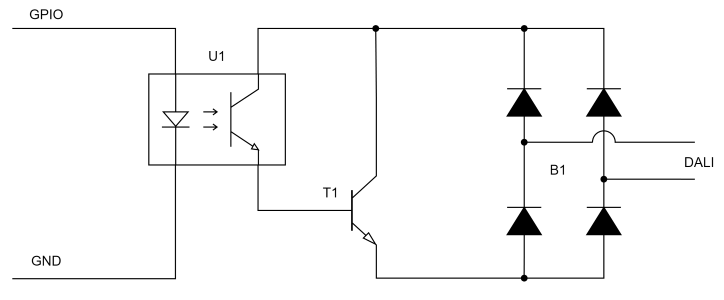

# ESPHome_DALI-Interface
A Module that allowes an ESP to send Data to DALI LED-Drivers over an simple DIY Interface.

## Information about DALI

see: https://de.wikipedia.org/wiki/Digital_Addressable_Lighting_Interface

## Hardware interface

used components:

- U1: pc817 (Optocoupler)
- T1: BD 137 (Transistor)
- B1: B140C1500 (Rectifier)




(its not the best one, because it wont complied with the DALI standard!)

## usage in ESPhome:

first example:
````
light:
  - platform: monochromatic
    name: "name of light"
    output: light_out
    gamma_correct : 0                 # no brightness correction 
    default_transition_length: 0s     # no transition (Faderate and fadetime will do that)
output:
  - platform: dali                         
    id: light_out                   # id output for light
    DALI_Hub: hub                   # id of dali hub
dali:
  id: hub                           # id of hub
  sending_pin: 5                    # your pin 
````

with two lights:
````
light:
  - platform: monochromatic
    name: "name of light 1"
    output: light_out_1
    ...
  - platform: monochromatic
    name: "name of light 2"
    output: light_out_2
    ...
output:
  - platform: dali                         
    id: light_out_1                 
    DALI_Hub: hub                   
  - platform: dali                         
    id: light_out_2                 
    DALI_Hub: hub                   
dali:
  id: hub                          
  sending_pin: 5                   
````


## planned features (if needed)

- sending Faderate and Fadetime
- interface for getting current brightness value etc
- reading values from the bus

## Others

thanks to ssieb and Azimath for getting started with the custom components on the official discord channel!

- github page ssieb: 				https://github.com/ssieb
- esphome Discord channel: 	https://discord.com/invite/KhAMKrd
